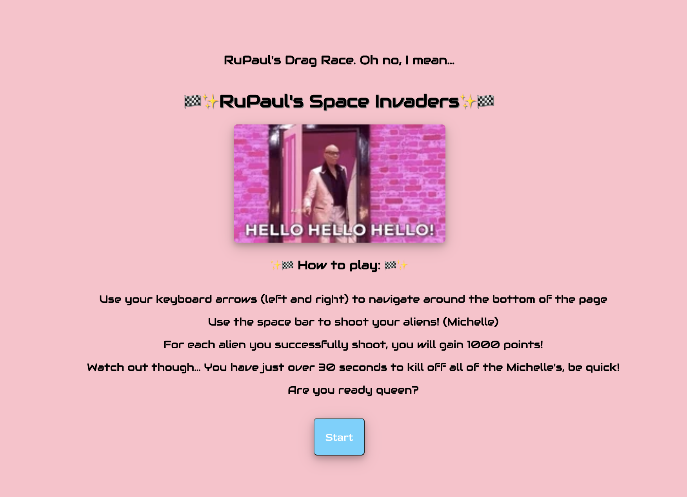
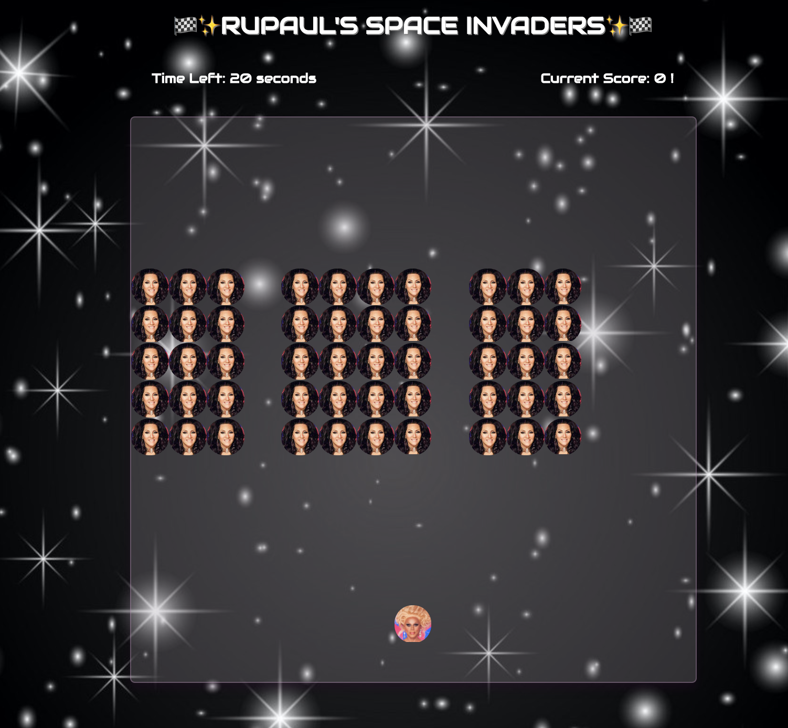
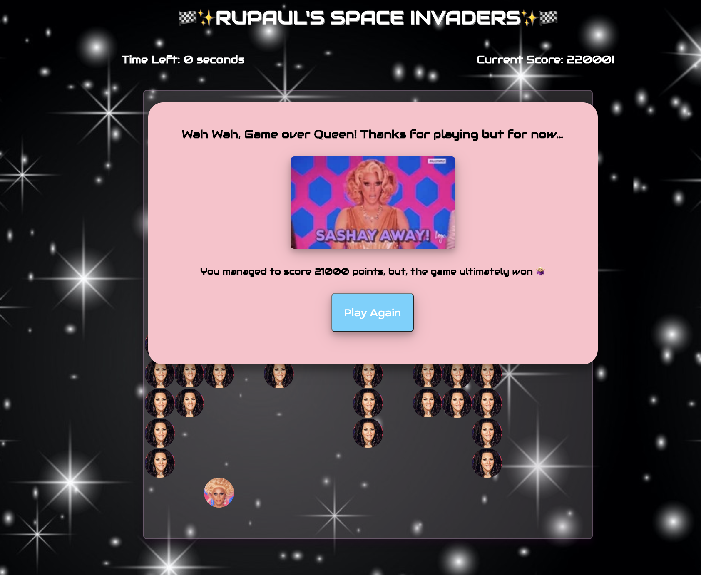

# Project 1: RuPaul's Space Invaders
### Overview
RuPaul's Space invaders is a browser-based arcade stlye game. It tests your speed by challenging you to kill all the aliens before they get to you. You need to kill all the aliens before the game is over in order to win.
This was my first project in General Assembly's Software Engineering Immersive course. It was an individual project assigned to us after 3 weeks of learning. It was the first real-life implementation of JavaScript.

## The game
You can find the hosted version of my game here: https://noafilosof08.github.io/SEI-project-1/

## Timeframe and Technologies
7 days to complete.

Technologies:
- JavaScript (ES6)
- HTML 5
- HTML audio
- CSS
- Google Fonts
- GitHub

## Game Instructions
1. The game begins with an opening page, detailing the instructions of how to play and what the goal is. After clicking on Start, the iconic 'Gentlemen start your engines...' audio will play before taking the player onto the next page



2. The timer starts and the player (RuPaul) at the bottom of the grid can only move left and right, and has to use their shooter (a lipstick bullet) to kill off the aliens (Michelle Visage).



3. Depending on whether the player wins or not, by shooting all the aliens before the time runs out, a pop up will appear notifying who has won and how many points they score. It also has the option to replay the game.



## Process
The first step was mounting the grid to the page, this was done using JavaScript. I then created my player, making sure that the playing could move along the grid, responding to keyboard touches. The difficulty here was ensuring that the player would stick to the bottom of the grid, could only move left and right, and couldn't escape the grid. This was done using swtich statements which listened to key strokes of particular keys.

Then, I created functionality to place the aliens, starting with one, and have it move down with a timer.

``` javascript
if (michelleIsMovingRight) {
        moveMichelleRight() // this moves the alien/Michelle to the right by 1 grid space
      } else {
        moveMichelleLeft() // this moves the alien/Michelle to the left by one grid space
      }
      // shootingMichelleLaser()
      numberOfMoves++
      if (numberOfMoves === 3) {
        numberOfMoves = 0
        michelleIsMovingRight = !michelleIsMovingRight
        moveMichelleDown() // if the alien/mMchelle has moved 3 times (to either the right or the left, then move the alien/Michelle down on the grid)
      }
      if (michellePosition === 105) {
        clearInterval(timerID)
        mainGameAudio.pause()
        addOutroLostPage() // if the aliens/Michelle's position on the gird is at 105, then stop the timer, and the audio, and add the game over page. This is because at the point the game will be over
      }
```

Next was creating the shoot functionality. This was done that when the player pressed the space key, laser was fired, moving up the page. This then led to the next bit of functionality, the collision. An if statement checked if the laser was on the same grid square as an alien, if it was it would remove both the alien and the laser, if not the laser would continue to the top of the page.

I then added the rest of the aliens to the page and got them moving simultaneously.

I generated a win function the check if all the aliens were killed by the time the timer had run out.

A huge aspect of the game was styling, this fed into the functionality hugely, as well as the user experience.
  - adding a points tracker in the corner as well as a visible timer.
  - 2 different outcomes pages: one for game won and one for game lost.
  - 4 different bits our audio which play depending on which stage of the game you're at.

## Challenges
One of the biggest challenges for me was the collision. Once I got it working, I wanted to make it look like an actual collision. The idea was that an image would appear for 1 second. However, once I did this the image was 'buggy' depending on how aggressive the player is with its shooting, the image sometimes was left over making it confusing for the player.

## Key Learnings
One of my biggest worries was working on my own. We had only done 3 weeks of coding at this point and I didn't feel to confident to tackle this task alone. However, I found that when I worked on my own, I was really good at managing my own time as well as my own expectations. I also really enjoyed being able to get really creative and pour some of my personality into the project. This project taight me that if it seems a bit scary at first, thats ok, and to just push through and deliver your best.

## Future Features
- Adding 'levels' to the game to make it harder
- Enabling the aliens to randomly shoot the player
- Choosing your players and the aliens you will shoot
- Responsive! At the moment you can only play on a computer as it's reliant on keyboard
- Many more...
